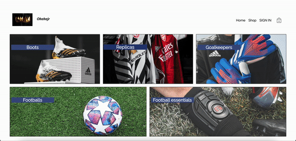

# Ok-soccer-store-by-Okeke

This is an online store react, which provides the great UI, use of react Context, react router, react hooks, login with google, login with email and password, sign out features, storing and retrieving data with firebase. Add items, increase and reduce item number, remove items from cart, checkout page and cart page. it simulates a real e-commerce website its vast features, and mobile responsive.

## Installation (for standard modern project) and run project

```bash
npm i
```

```bash
npm start
```

## Demo



#### Live link

```
http://e-commerce-soccer-store.vercel.app/
```

## Stack

<p align="left"> <a href="https://www.w3schools.com/css/" target="_blank">  </a> <a href="https://www.w3.org/html/" target="_blank">  </a>   
